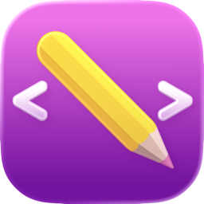
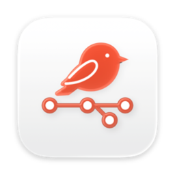
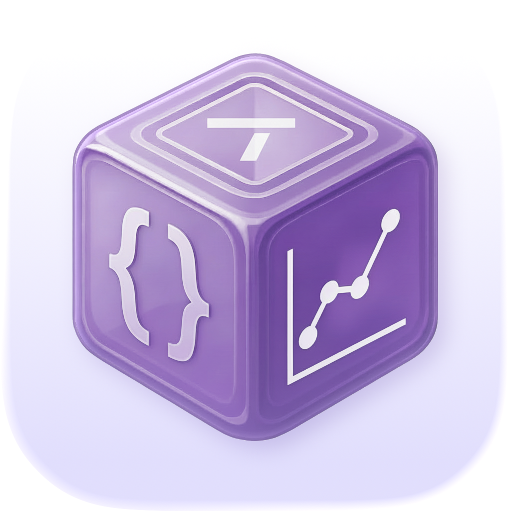
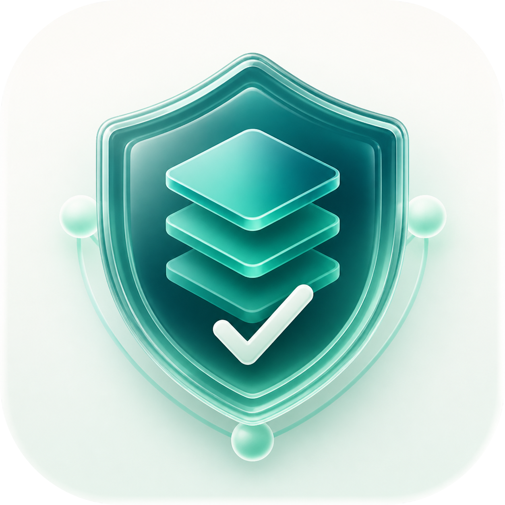

<h1 align="center">h3p</h1>

  Independent developer · Copenhagen 
  Native Apple tools, calm interfaces, and reliable systems.

  <a href="https://h3p.me">Creative portfolio</a> ·
  <a href="https://github.com/h3pdesign/h3pdesign.github.io">Developer portfolio</a> ·
  <a href="https://apps-h3p.com">Apps & documentation</a>

## A focused software practice

I make native software for Apple platforms, alongside the small systems that help people use, understand, and maintain it. The work is built around performance, readability, explicit privacy, and long-term usefulness.

My creative portfolio, [h3p.me](https://h3p.me), brings together the work, writing, photography, and journal.

## Selected work

-  [Neon Vision Editor](https://h3pdesign.github.io/Neon-Vision-Editor/) — native code and Markdown editor for macOS, iPadOS, iOS, and visionOS.
-  [GitBird](https://github.com/h3pdesign/GitBird) — a focused macOS menu-bar companion for GitHub and GitLab notifications.
-  [Lingua Latina](https://h3pdesign.github.io/Lingua-Latina-Public/) — a quiet companion for Latin vocabulary, translation, and grammar.
-  [Metrics Data](https://h3pdesign.github.io/Metrics-Data-Public/) — public product information and support materials.
-  [Data Reliability Index](https://github.com/h3pdesign/data-reliability-index) — Python tools for attaching trust metadata to data.

## Portfolios, apps, and GitHub Pages

| Site | Focus |
| --- | --- |
| [h3p.me](https://h3p.me) | Creative portfolio — work, writing, photography, and Voyages |
| [Developer portfolio](https://github.com/h3pdesign/h3pdesign.github.io) | Source and GitHub Pages site for developer work |
| [h3p apps](https://apps-h3p.com/) | App documentation, support, and release notes |
| [Neon Vision Editor](https://h3pdesign.github.io/Neon-Vision-Editor/) | Product site and downloads |
| [Lingua Latina](https://h3pdesign.github.io/Lingua-Latina-Public/) | Product information and support |
| [Metrics Data](https://h3pdesign.github.io/Metrics-Data-Public/) | Product information and updates |
| [Voyages](https://h3pdesign.github.io/voyages/) | Travel writing, photographs, and maps |

## Current focus

- Editor architecture, large-file performance, and cross-device workflows
- Native Apple development with SwiftUI, AppKit, and UIKit
- Python tooling, data visualization, and monitoring systems
- CI/CD, automated release workflows, and reliable distribution

## Native-first principles

Software should feel sharp, calm, and reliable. I favor native performance, fast startup, readable interfaces, and focused products over feature overload.

For Neon Vision Editor, that means no Electron, no telemetry, and no subscription maze; AI assistance is optional and responds only when requested.

## Toolset

Swift · SwiftUI · AppKit · UIKit · Python · SQLite · GitHub Actions · Azure

## Working principles

Native by default. Human by design.

I prefer focused software over feature overload: responsive interfaces, maintainable architecture, low-friction workflows, and products that stay out of the way.

Swift · SwiftUI · AppKit · UIKit · Python · GitHub Actions
